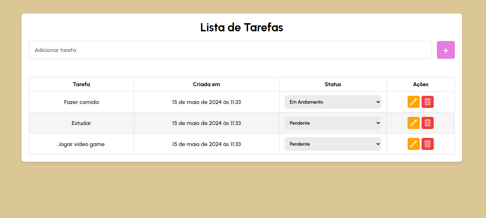

<h1>Lista de Tarefas</h1>

<h3>Tecnologias:</h3>
 

NodeJS, Express, MySQL, HTML5, CSS3 e JavaScript

<h3>Instruções:<h3>

<h5>Clonar Repositório:</h5>
 

Digite no terminal "git clone https://github.com/Augphp16/listaDeTarefas"

<h5>Instalar dependências:</h5>
 

Digite no terminal "cd backend/"  "npm install"

<h5>Query's SQL</h5>
 

CREATE DATABASE database_name;

 USE database_name;
 CREATE TABLE tasks(id INT PRIMARY KEY AUTO_INCREMENT, title VARCHAR(45) NOT NULL, status VARCHAR(45)NOT NULL, created_at VARCHAR(45) NOT NULL);
